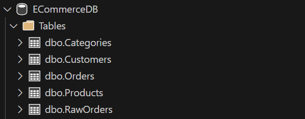

# ⚙️ Kiến trúc E-Commerce Data Pipeline (ELT)

Dự án áp dụng mô hình **ELT (Extract - Load - Transform)** để đảm bảo khả năng mở rộng (Scalability) và dễ dàng bảo trì. Toàn bộ quy trình xử lý được module hóa gọn gàng thành 3 kịch bản chính:

### Tổng quan Quy trình Pipeline

| Giai đoạn            | Kịch bản SQL (Script)       | Mục tiêu Cốt lõi                              | Kỹ thuật áp dụng                    |
| -------------------- | --------------------------- | --------------------------------------------- | ----------------------------------- |
| **1. Nạp (E-L)**     | `01_setup_and_import.sql`   | Nạp siêu tốc dữ liệu CSV thô vào hệ thống.    | `BULK INSERT`, `Staging Table`      |
| **2. Chuẩn hóa (T)** | `02_data_normalization.sql` | Tái cấu trúc Flat Data thành mô hình 3NF.     | `Primary/Foreign Key`, Data Casting |
| **3. Phân tích**     | `03_advanced_analytics.sql` | Trích xuất Business Insights từ dữ liệu sạch. | `CTEs`, `Window Functions`          |

---

## 🛠️ Chi tiết Kỹ thuật (Technical Details)

### Bước 1: Khai thác & Nạp Dữ liệu (Extract & Load)

| Thành phần        | Phương pháp xử lý               | Lợi ích / Lý do                                      |
| ----------------- | ------------------------------- | ---------------------------------------------------- |
| **Staging Table** | Tạo bảng tạm `RawOrders`        | Là vùng đệm (buffer) an toàn trước khi xử lý logic.  |
| **Data Types**    | Gán toàn bộ bằng `VARCHAR(MAX)` | Ngăn chặn triệt để lỗi _Data Truncation_ khi import. |
| **Import Method** | Sử dụng lệnh `BULK INSERT`      | Tối ưu hóa cực độ thời gian nạp 51,290 bản ghi.      |

### Bước 2: Chuẩn hóa Dữ liệu chuẩn 3NF (Data Normalization)

| Bảng Đích (Target) | Vai trò         | Chi tiết Kỹ thuật Xử lý                                                     |
| ------------------ | --------------- | --------------------------------------------------------------------------- |
| `Customers`        | Dimension Table | Xóa trùng lặp (Dedup) bằng `GROUP BY` và hàm `MAX()`.                       |
| `Products`         | Dimension Table | Dùng `IDENTITY(1,1)` để tự động sinh Surrogate Key (ID).                    |
| `Categories`       | Dimension Table | Cấu trúc hóa quan hệ cha - con (Self-referencing Foreign Key).              |
| `Orders`           | Fact Table      | Ép kiểu (`INT`, `FLOAT`, `DATE`), lập `Foreign Keys` kết nối các Dimension. |
| `RawOrders`        | Staging Table   | Bảng lưu trữ tạm thời dữ liệu gốc trước khi chuẩn hóa.                      |

### Bước 3: Phân tích Kinh doanh (Advanced Analytics)

| Kỹ thuật SQL Nâng cao  | Bài toán kinh doanh được giải quyết                                                            |
| ---------------------- | ---------------------------------------------------------------------------------------------- |
| **Window Functions**   | Dùng `RANK() OVER()` xếp hạng doanh thu, `SUM() OVER()` tính dòng tiền lũy kế (Running Total). |
| **Recursive CTE**      | Dùng truy vấn đệ quy để duyệt và vẽ cây sơ đồ danh mục ngành hàng phức tạp.                    |
| **CTEs (WITH clause)** | Đóng gói logic tính toán vòng đời khách hàng (LTV) để tìm ra top Khách VIP.                    |
