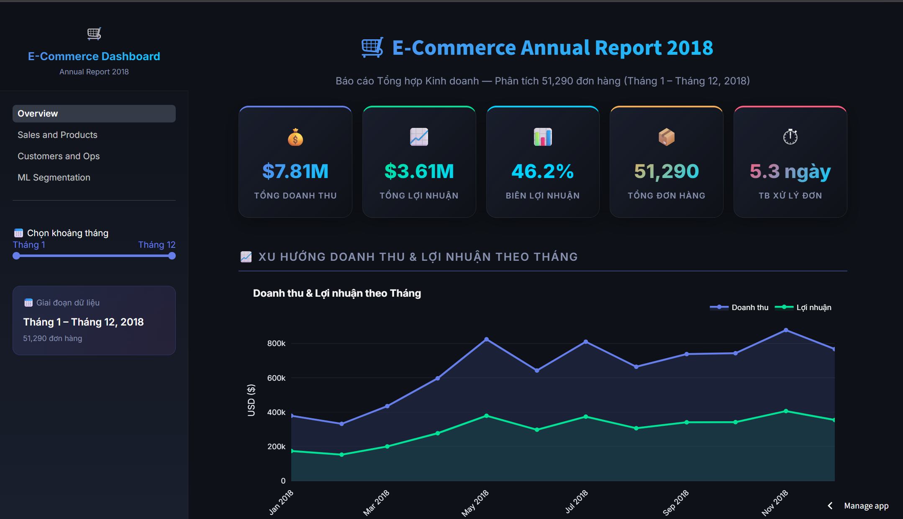
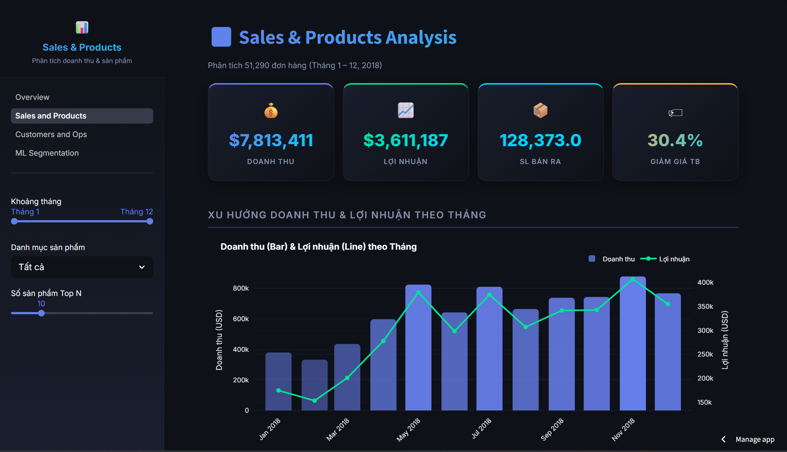
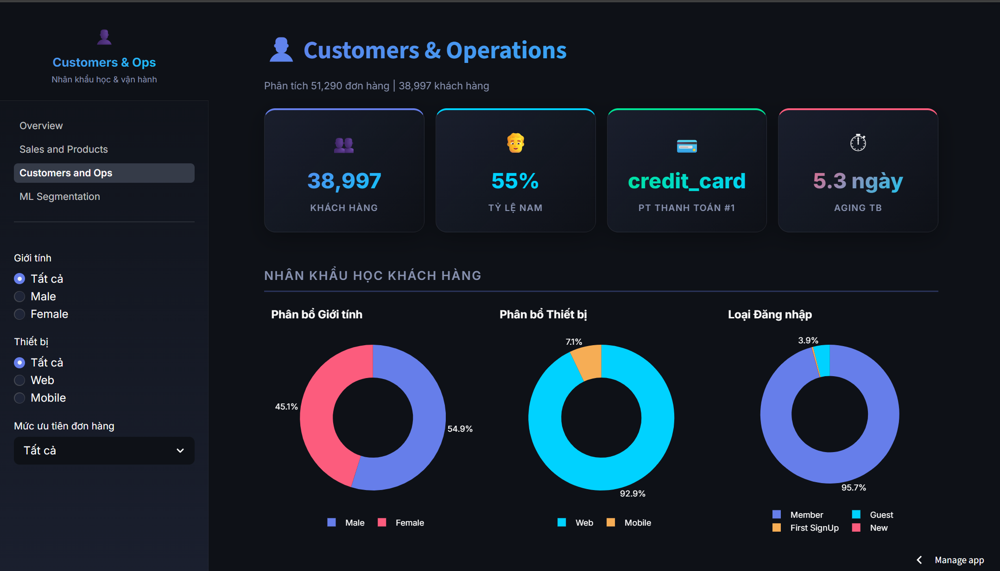
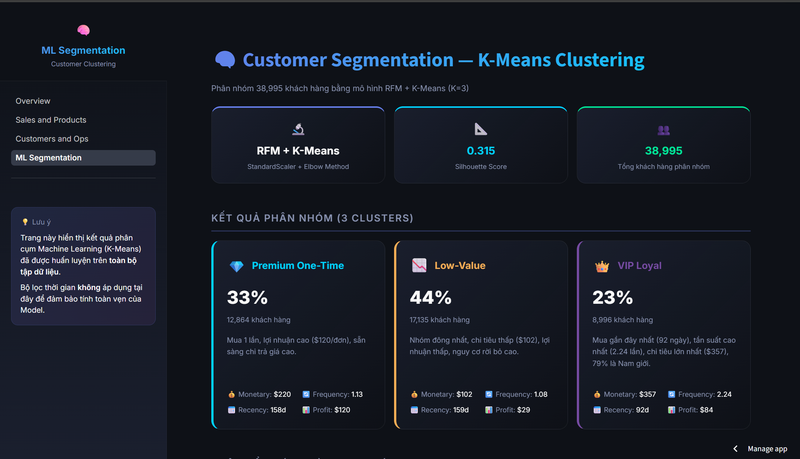

# 📊 Dashboard Tương tác — Báo cáo Tổng hợp E-Commerce 2018

Trực quan hóa toàn bộ kết quả phân tích SQL và ML Segmentation cho dữ liệu E-Commerce 2018 thành **Dashboard tương tác 4 trang**, phục vụ ra quyết định kinh doanh nhanh chóng và chính xác.

**🌐 Xem trực tiếp:** [https://ecommerce-annual-report-2018.streamlit.app/](https://ecommerce-annual-report-2018.streamlit.app/)

**💡 Lưu ý:** Vì host trên server miễn phí của Streamlit, ứng dụng có thể chuyển sang trạng thái "ngủ đông" (sleeping) nếu không có lượt truy cập sau một thời gian. Nếu bạn gặp màn hình báo ngủ đông, chỉ cần click vào nút **"Yes, get this app back up!"** và đợi khoảng 1-2 phút để hệ thống khởi động lại!

**Nguồn dữ liệu:** Đọc trực tiếp từ `../data/cleaned/` (4 file CSV đã chuẩn hóa 3NF)

---

## 🚀 Cài đặt & Khởi chạy

```bash
cd dashboard
pip install -r requirements.txt
python -m streamlit run Overview.py
```

Truy cập tại: `http://localhost:8501`

---

## 📑 Cấu trúc 4 Trang Dashboard

Để hỗ trợ ra quyết định kinh doanh nhanh chóng và tập trung vào các kết quả phân tích giá trị, hệ thống Dashboard được phân rã thành 4 trang chuyên biệt dưới đây. Mỗi trang đều đi kèm hình ảnh giao diện trực quan và các nhận định kinh doanh cốt lõi (Key Insights).

---

### 1. Executive Overview (Tổng quan Điều hành)

_Trang chính hiển thị bức tranh toàn cảnh về hiệu suất kinh doanh năm 2018._



- **Nội dung chính:** 5 thẻ chỉ số KPI cốt lõi (Doanh thu, Lợi nhuận, Biên LN, Tổng đơn, Thời gian xử lý TB), Biểu đồ xu hướng doanh số theo tháng, Phân bổ doanh số theo danh mục và Top 5 sản phẩm bán chạy nhất.

#### 💡 Key Insights:

- **Hiệu suất Tài chính Vượt trội:** Doanh thu đạt $7.8M với biên lợi nhuận ròng rất ấn tượng (**46.2%**), cho thấy doanh nghiệp có cấu trúc định giá sản phẩm và tối ưu chi phí rất tốt.
- **Hiệu ứng Mùa vụ (Seasonality):** Doanh số đạt đỉnh vào cuối năm (Tháng 5 và Tháng 11 đạt doanh số cao nhất, xấp xỉ $0.9M - $1.0M), chỉ ra cơ hội lớn để triển khai các chiến dịch Marketing kích cầu hoặc tối ưu hóa chuỗi cung ứng trước các đợt mua sắm cao điểm.
- **Danh mục Trọng tâm:** Ngành hàng **Thời trang (Fashion)** đóng vai trò là động cơ tăng trưởng chính, trong đó **Áo thun (T-Shirts)** đóng góp doanh thu lớn nhất.
- **Kênh thanh toán Chủ đạo:** Phương thức thanh toán qua **Thẻ tín dụng (Credit Card)** chiếm ưu thế tuyệt đối (74% doanh thu), gợi mở hướng liên kết ngân hàng để tung ra các khuyến mãi giảm giá trực tiếp cho khách hàng.

---

### 2. Sales & Products (Phân tích Doanh thu & Sản phẩm)

_Trang phân tích chuyên sâu về hiệu suất của từng danh mục và xếp hạng sản phẩm._



- **Nội dung chính:** Biểu đồ kết hợp (Combo Chart) Doanh thu & Lợi nhuận, Biểu đồ doanh thu lũy kế (Running Total Area), Bản đồ nhiệt (Heatmap) giao dịch theo ngày và giờ, Bảng chi tiết xếp hạng sản phẩm và So sánh hiệu suất giữa các quý.

#### 💡 Key Insights:

- **Xu hướng tăng trưởng lũy kế:** Doanh thu lũy kế tăng trưởng ổn định trong suốt cả năm, đặc biệt tăng tốc nhanh vào Quý 4, chứng minh mức độ hấp thụ thị trường rất tốt.
- **Heatmap Phân bố Ngày & Tháng:** Giao dịch tập trung mạnh vào các ngày giữa tuần (Thứ Tư, Thứ Năm) của các tháng cao điểm. Việc này định hướng trực tiếp cho đội ngũ Marketing trong việc lên lịch chạy quảng cáo hoặc Flash Sale nhắm mục tiêu vào các khung giờ này để đạt tỷ lệ chuyển đổi cao nhất.
- **Đóng góp của Nhóm dẫn đầu (Top-Selling Products):** Nhóm 10 sản phẩm hàng đầu (đặc biệt là T-Shirts, Watches và Running Shoes) tạo ra hơn 50% doanh số của toàn ngành hàng. Tuy nhiên, một số mặt hàng bán chạy đang chịu mức giảm giá trung bình cao (lên tới 15-20%), cần cân đối lại để không bào mòn lợi nhuận.
- **Đỉnh cao Quý 4 (Q4 Peak):** Doanh thu và lợi nhuận tăng trưởng đều qua các quý và bùng nổ mạnh mẽ ở Q4. Doanh số Q4 cao hơn Q1 tới **60%**, khẳng định tính chu kỳ mua sắm mạnh mẽ của người tiêu dùng thương mại điện tử vào dịp lễ hội cuối năm.

---

### 3. Customers & Ops (Khách hàng & Vận hành)

_Trang phân tích chi tiết về nhân khẩu học khách hàng, tập khách hàng VIP và hiệu suất logistics._



- **Nội dung chính:** Tỷ lệ phân bổ giới tính, thiết bị truy cập và phương thức đăng nhập; Bảng xếp hạng 10 khách hàng VIP (chi tiêu cao nhất); Biểu đồ phân bổ thời gian xử lý đơn (Aging Histogram); Chi phí vận chuyển theo mức độ ưu tiên và Phân tích phương thức thanh toán.

#### 💡 Key Insights:

- **Chân dung Khách hàng Mục tiêu:** Khách hàng **Nam giới** chiếm tỷ trọng áp đảo (~58-60%), và ứng dụng di động (Mobile) hoặc trang web (Web) là phương tiện truy cập chính. Tỷ lệ checkout trên thiết bị Mobile cực cao đòi hỏi giao diện mua sắm và thanh toán trên di động phải được tối ưu mượt mà nhất.
- **Sức mạnh tập khách hàng VIP:** Top 10 khách hàng VIP tạo ra doanh thu trung bình rất lớn ($10k - $12k+ mỗi người), đặc biệt cơ cấu giới tính nhóm VIP cũng chủ yếu là Nam giới. Điều này ủng hộ mạnh mẽ việc xây dựng một **chương trình khách hàng thân thiết VIP (Loyalty Program)** riêng biệt với các đặc quyền độc quyền cho nam giới.
- **Nút thắt Logistics (Fulfillment & Shipping Cost):** Biểu đồ Aging Histogram chỉ ra rằng phần lớn đơn hàng mất từ 4 đến 7 ngày để xử lý xong (trung bình 5.3 ngày), với một số đơn hàng bị kéo dài trên 8 ngày. Phí giao hàng trung bình tăng vọt đối với các đơn hàng có mức ưu tiên cao (Critical/High), cho thấy chi phí vận hành logistics bị đẩy cao do xử lý đơn hàng khẩn cấp. Doanh nghiệp cần tối ưu hóa quy trình kho vận để giảm thiểu các đơn hàng khẩn cấp này.
- **Tối ưu hóa Cổng thanh toán:** Thẻ tín dụng thống trị tuyệt đối về cả số lượng và giá trị giao dịch, trong khi Ví điện tử (E-wallet) vẫn chưa được khai phá hiệu quả. Cần tích cực hợp tác với các bên ví điện tử (Momo, ShopeePay...) để đưa ra các chương trình hoàn tiền (cashback) nhằm đa dạng hóa kênh thanh toán số.

---

### 4. ML Segmentation (Phân khúc Khách hàng bằng Học máy)

_Trang trình bày kết quả phân cụm khách hàng nâng cao dựa trên mô hình RFM và thuật toán K-Means._



- **Nội dung chính:** Các thẻ thông số cụm, biểu đồ Radar RFM (Recency, Frequency, Monetary), biểu đồ phân bổ tỷ lệ các nhóm khách hàng và đề xuất chiến lược Marketing tương ứng cho từng nhóm.

#### 💡 Key Insights:

Mô hình K-Means (K=3, Silhouette Score = 0.315) đã chia 38,995 khách hàng thành 3 nhóm rõ rệt với các đặc tính hành vi sâu sắc:

- **Nhóm 1: VIP Loyal (23% khách hàng):** Đây là nhóm khách hàng lý tưởng nhất, mua hàng gần đây nhất (trung bình 92 ngày), tần suất mua hàng cao nhất (2.24 lần) và chi tiêu lớn nhất ($357/đơn). Nhóm này chủ yếu là **Nam giới (79%)**.
  - _Chiến lược:_ Áp dụng chương trình đặc quyền VIP, gửi ưu đãi sớm (early access) cho các sản phẩm mới, thiết kế các chiến dịch Marketing cá nhân hóa cao cho nam giới.
- **Nhóm 2: Premium One-Time (33% khách hàng):** Nhóm mua 1 lần nhưng chi tiêu rất cao ($220/đơn) và mang lại biên lợi nhuận lớn nhất cho mỗi đơn hàng ($120/đơn). Tuy nhiên họ đã không tương tác trong thời gian dài (trung bình 158 ngày).
  - _Chiến lược:_ Gửi email/SMS nhắc nhở mua lại kèm theo các gợi ý sản phẩm bán kèm (Cross-sell/Up-sell) liên quan đến sản phẩm họ đã mua, nhằm chuyển đổi họ thành khách hàng trung thành.
- **Nhóm 3: Low-Value (44% khách hàng - Chiếm tỷ trọng đông nhất):** Nhóm chi tiêu rất thấp ($102/đơn), lợi nhuận mang lại thấp ($29/đơn), tần suất mua thấp và nguy cơ rời bỏ (churn) rất cao.
  - _Chiến lược:_ Chạy các chiến dịch Retargeting với voucher giảm giá mạnh để kích hoạt lại hoạt động mua sắm, nhưng cần kiểm soát chặt chẽ chi phí Marketing để đảm bảo ROI dương.

---
