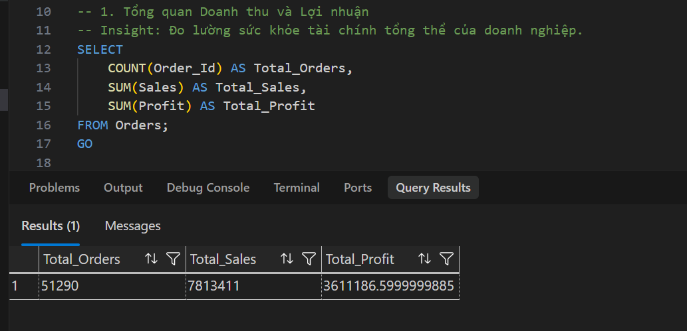
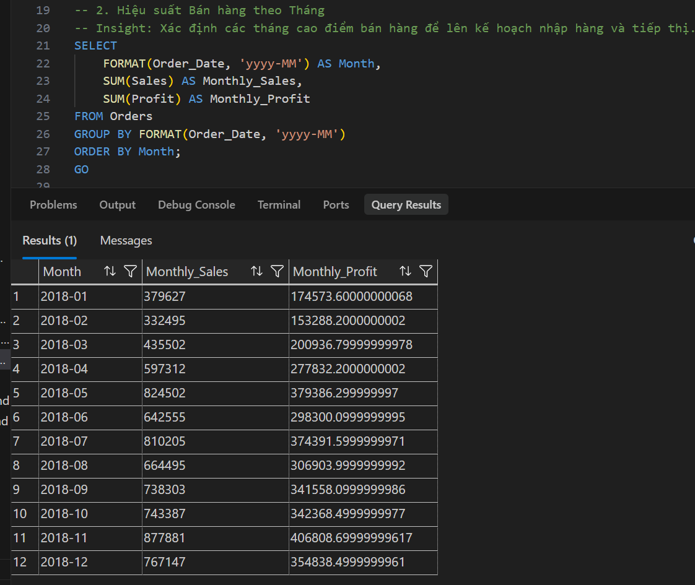
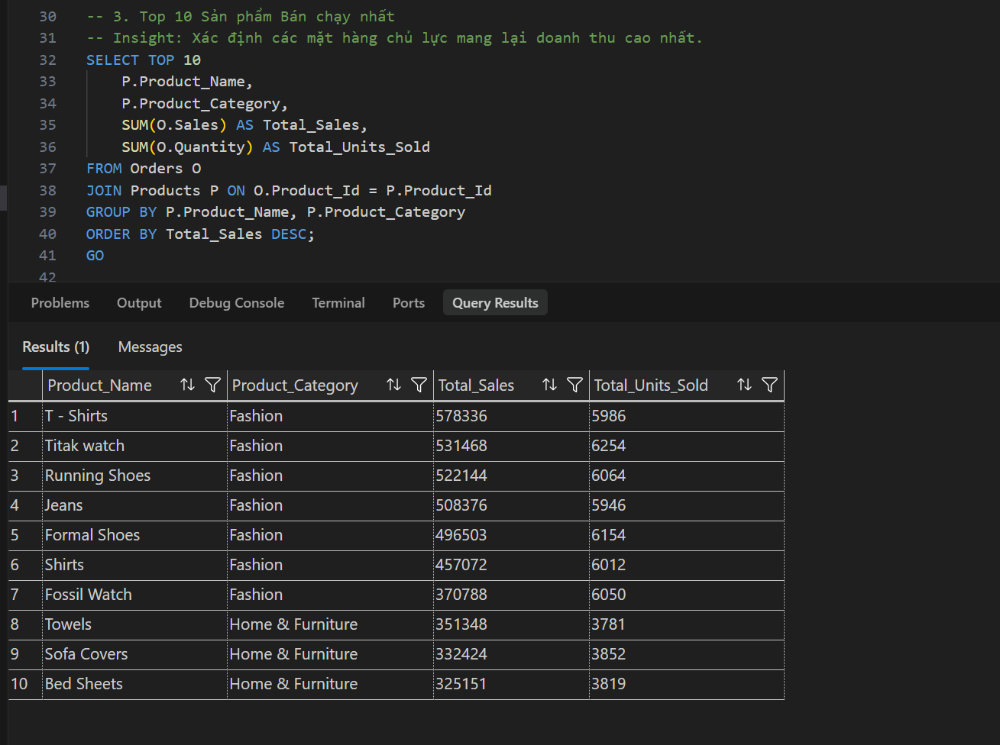
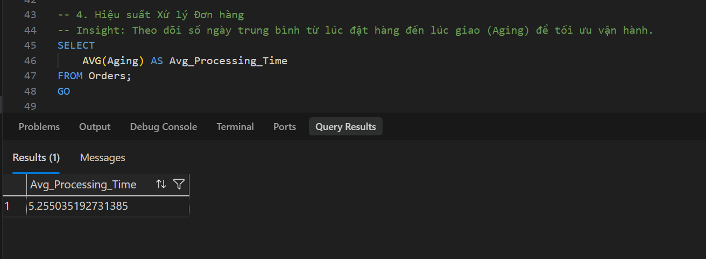
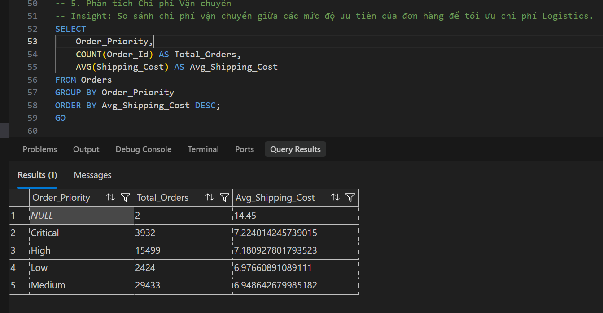
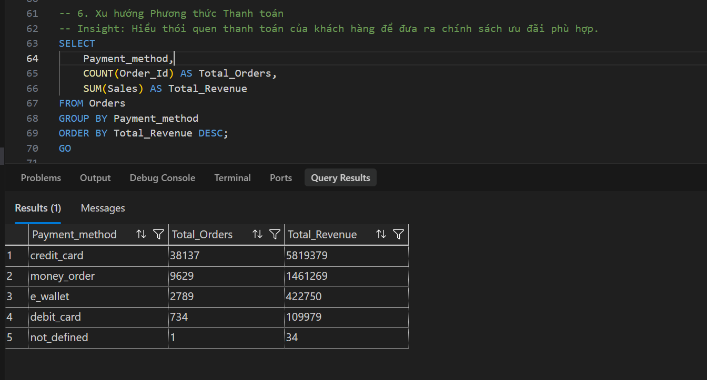
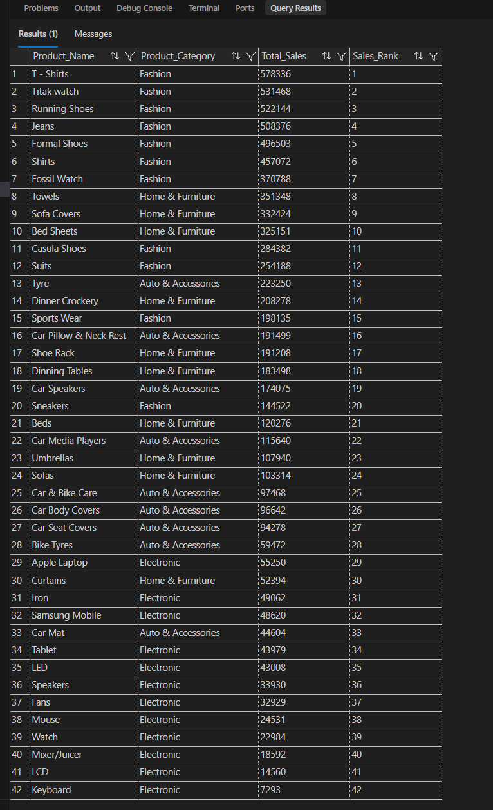
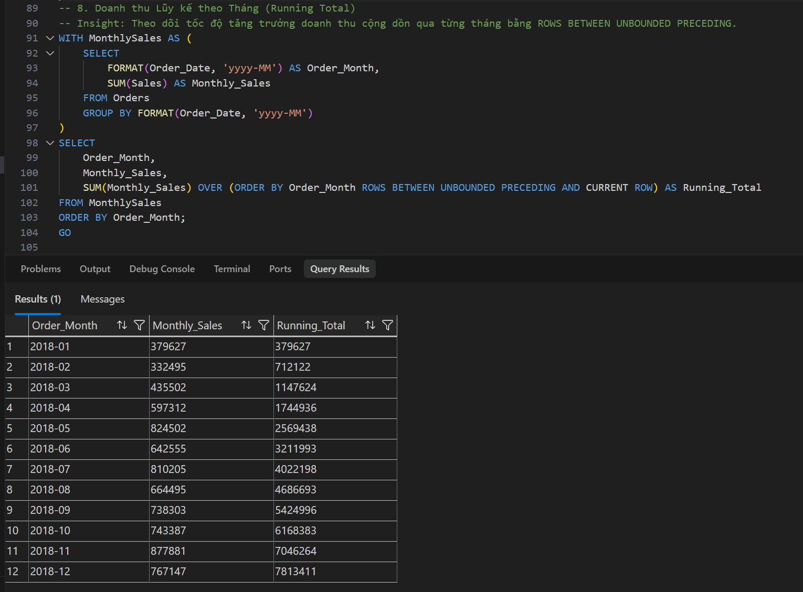
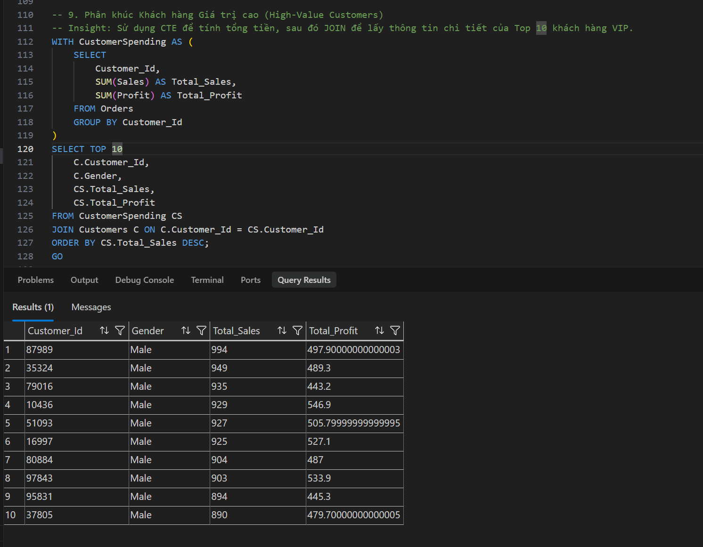
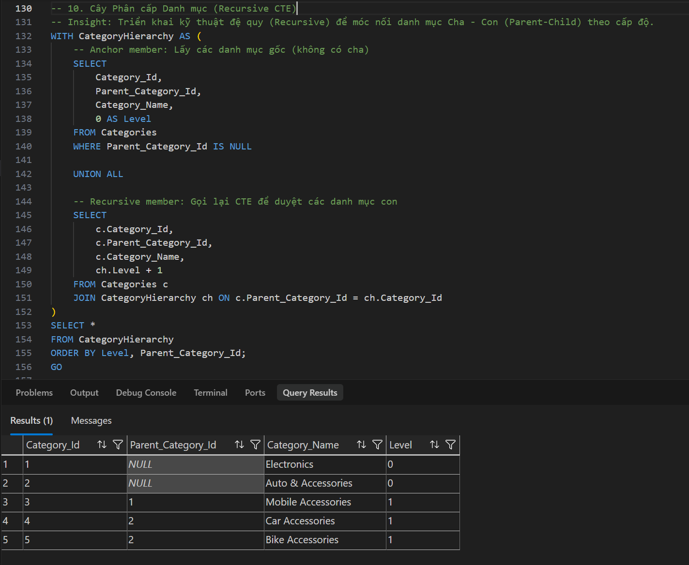

# 📈 Phân tích Dữ liệu Với SQL (SQL Analytics Showcase)

Phân tích Dữ liệu trong dự án E-Commerce của tôi. Mục tiêu của phần này là **chứng minh khả năng tư duy phân tích (Analytical Thinking)** và **kỹ năng xử lý T-SQL phức tạp** (bao gồm CTEs, Window Functions, và Recursive Queries) ứng dụng vào thực tế doanh nghiệp.

Dưới đây là kết quả thực thi từ 10 bài toán phân tích mà tôi đã giải quyết trong kịch bản `03_advanced_analytics.sql` (dựa trên tập dữ liệu lịch sử năm 2018). Đối với mỗi truy vấn, tôi không chỉ dừng lại ở việc trích xuất số liệu mà còn đúc kết ra một dòng **Key Insight** để minh chứng cho khả năng Business Sense của mình.

---

### 1. Tổng quan Doanh thu và Lợi nhuận (Total Sales & Profit)

💡 **Key Insight:** Doanh nghiệp ghi nhận tổng doanh thu khổng lồ **7.81 triệu USD** từ hơn 51,000 đơn hàng. Đặc biệt, biên lợi nhuận (Profit Margin) đạt mức rất ấn tượng **46.2%** (~3.6 triệu USD), chứng tỏ mô hình kinh doanh đang sinh lời cực kỳ hiệu quả.

---

### 2. Hiệu suất Bán hàng theo Tháng (Monthly Sales Performance)

💡 **Key Insight:** Bức tranh doanh thu thể hiện rõ tính mùa vụ (Seasonality). Doanh số chạm đáy vào Tháng 2 (~332k USD), nhưng bùng nổ mạnh mẽ vào các tháng 5, 7 và đạt đỉnh điểm vào Tháng 11 (Black Friday) với hơn **877k USD**, kéo theo lợi nhuận kỷ lục >400k USD.

---

### 3. Top 10 Sản phẩm Bán chạy nhất (Top 10 Selling Products)

💡 **Key Insight:** Ngành hàng Thời trang (Fashion) thống trị tuyệt đối khi chiếm trọn 7/10 vị trí dẫn đầu. Đáng chú ý, "T-Shirts" là nhà vô địch doanh thu (hơn 578k USD) mặc dù số lượng bán ra (5,986 cái) thậm chí còn ít hơn dòng đồng hồ "Titak watch" (6,254 cái), cho thấy biên độ sinh lời cực tốt của mặt hàng này.

---

### 4. Hiệu suất Xử lý Đơn hàng (Order Processing Performance)

💡 **Key Insight:** Chỉ số Aging (thời gian trung bình từ lúc khách đặt đến lúc giao hàng) đang nằm ở mức **5.25 ngày**. Đây là một con số khá cao so với tiêu chuẩn E-commerce hiện đại (thường dưới 3 ngày), báo động đỏ về quy trình vận hành kho bãi (Warehouse Operations) đang bị quá tải.

---

### 5. Phân tích Chi phí Vận chuyển (Shipping Cost Analysis)

💡 **Key Insight:** Chi phí giao hàng trung bình giữa các mức độ ưu tiên dao động với biên độ rất hẹp (chỉ từ 6.94 USD cho mức Medium đến 7.22 USD cho mức Critical). Điều này chứng tỏ công ty đã đàm phán được biểu phí vận chuyển (Flat-rate) tuyệt vời với các đối tác Logistics, tối ưu hóa được chi phí ngay cả với các đơn hỏa tốc.

---

### 6. Xu hướng Phương thức Thanh toán (Payment Method Trends)

💡 **Key Insight:** Thẻ tín dụng (`credit_card`) là mạch máu thanh toán chính, chiếm tới hơn 5.8 triệu USD doanh thu (vượt xa mức 1.4 triệu USD của `money_order`). Các hình thức như `e_wallet` (ví điện tử) vẫn chưa thực sự bùng nổ trong tệp khách hàng này.

---

### 7. Xếp hạng Sản phẩm theo Doanh thu (Window Function - Ranking)

💡 **Key Insight:** Bảng xếp hạng bộc lộ rõ nguyên lý Pareto (Quy tắc 80/20) trong bán lẻ. Khoảng cách doanh thu giữa Top 1 (`T-Shirts`: ~578k USD) và Top dưới (như `Bike Tyres` hạng 28: ~59k USD) chênh lệch tới 10 lần. Điều này đòi hỏi chiến lược tái phân bổ ngân sách Marketing, tập trung đẩy mạnh các mặt hàng Top 10 và có chính sách thanh lý (Clearance) cho hàng tồn kho nhóm dưới.

---

### 8. Doanh thu Lũy kế theo Tháng (Running Total)

💡 **Key Insight:** Bức tranh dòng tiền cộng dồn (Running Total) vô cùng khỏe mạnh khi cán mốc 1 triệu USD ngay trong Quý 1 và băng băng vượt mốc 7.8 triệu USD vào cuối năm. Sự tăng trưởng dương liên tục này khẳng định tốc độ mở rộng thị phần cực kỳ ổn định, không gặp phải các cú sốc về dòng tiền lưu động.

---

### 9. Phân khúc Khách hàng Giá trị cao (High-Value Customers CTE)

💡 **Key Insight:** Danh sách Top 10 khách hàng chi tiêu "đậm" nhất (dao động từ 890 đến gần 1,000 USD) bộc lộ một đặc điểm nhân khẩu học cực kỳ thú vị: **100% đều là Nam giới (Male)**. Phát hiện này là cơ sở vàng để đội ngũ Marketing tung ra các chiến dịch nhắm mục tiêu (Targeted Ads) bán chéo các sản phẩm cao cấp dành riêng cho phái mạnh.

---

### 10. Cây Phân cấp Danh mục (Recursive CTE - Category Hierarchy)

💡 **Key Insight:** Bằng kỹ thuật Đệ quy (Recursive), CSDL phẳng đã được biến đổi thành cấu trúc cây gia phả một cách tinh tế. Dữ liệu thực tế cho thấy rất rõ mối quan hệ này: Ngành mẹ `Electronics` (Level 0) trực tiếp sinh ra nhánh con `Mobile Accessories` (Level 1). Cấu trúc phân tầng chặt chẽ này không chỉ tối ưu hóa trải nghiệm tìm kiếm trên Website mà còn tạo tiền đề vững chắc để xây dựng thuật toán Gợi ý mua sắm (Recommendation Systems).

---

## 🎯 Tổng kết Kinh doanh (Executive Summary)

Dựa trên 10 kết quả truy vấn phân tích dữ liệu ở trên, có thể đúc kết bức tranh toàn cảnh về doanh nghiệp trong năm tài chính 2018 như sau:

1. **Hiệu quả Sinh lời & Sản phẩm cốt lõi:** Doanh nghiệp đang có tỷ suất lợi nhuận xuất sắc (46.2%). Đóng góp lớn nhất vào nguồn thu này là mảng **Thời trang (Fashion)**, tuân thủ đúng quy tắc Pareto (80/20). Cần dồn ngân sách Marketing vào mảng này và có chính sách thanh lý các mặt hàng tồn kho top dưới.
2. **Chân dung Khách hàng VIP:** Tệp khách hàng chi tiêu mạnh tay nhất là **100% Nam giới**. Đây là "mỏ vàng" để triển khai các chiến dịch quảng cáo nhắm mục tiêu (Targeted Ads) và bán chéo (Cross-sell) chuyên biệt.
3. **Thanh toán & Mùa vụ:** Doanh số bùng nổ mạnh vào cuối năm (Tháng 11). Dòng tiền chủ yếu chảy qua mạch máu **Thẻ tín dụng (Credit Card)**.
4. **Cảnh báo Vận hành (Bottleneck):** Dù kiểm soát rất tốt chi phí Logistics (hợp đồng Flat-rate), thời gian xử lý đơn (Aging = 5.25 ngày) lại đang là một **điểm nghẽn** nghiêm trọng. Doanh nghiệp cần khẩn trương tối ưu hóa quy trình kho bãi để bắt kịp tốc độ tăng trưởng doanh số.
